# 🛒 DigitalShop API - E-commerce Backend

This repository contains a backend RESTful API for an e-commerce platform, developed during a software internship at **TIAC** in Novi Sad. The project was built using **ASP.NET Core** framework (C#) and **SQLite** database, with the aim of demonstrating modern principles of creating scalable and secure web applications.

The system enables complete management of users, products and shopping carts, with strict access control and advanced reporting based on business logic.

## 🚀 Key technologies and concepts

* **Architecture (N-Tier):** Logical separation into presentation layer (Controllers), business logic (Services) and data access (Repositories), respecting the principles of clean code and *Dependency Injection*.
* **Security (JWT & BCrypt):** JSON Web Token (JWT) implementation for role-based authentication and authorization (*Customer* and *Admin*). Passwords are never stored in clear text, but protected by modern hashing algorithms (*BCrypt*).
* **Database (EF Core & SQLite):** Used *Code-First* approach with Entity Framework Core ORM to efficiently map relations (One-to-Many, Many-to-Many) in a lightweight, fast SQLite database.
* **Validation (FluentValidation):** Robust validation of input data at the level of DTO (Data Transfer Object) classes, before the data even reaches the business logic.
* **Advanced LINQ Queries:** Optimized database queries to generate dynamic analytical reports (eg find best selling products by category).
* **Documentation (Swagger):** Integrated and custom Swagger UI that automatically generates documentation and allows API testing directly from the browser with JWT support.

## 📸 Application Screenshots

### 1. API Documentation & Architecture
[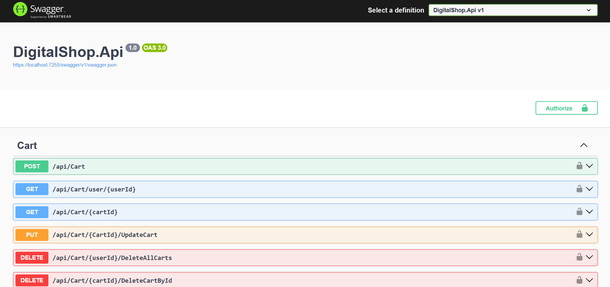](DigitalShop.Api/Controllers/CartController.cs)
[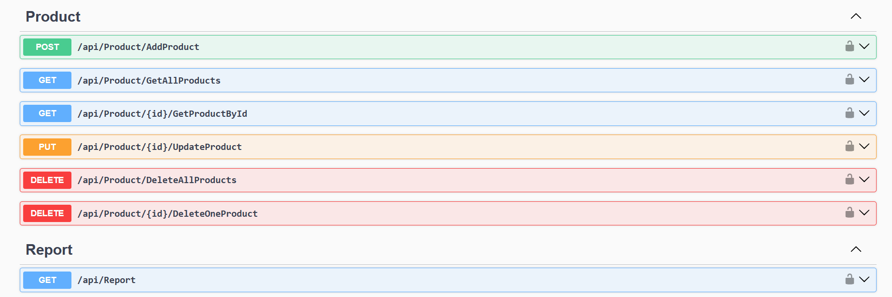](DigitalShop.Api/Controllers/ProductController.cs)
[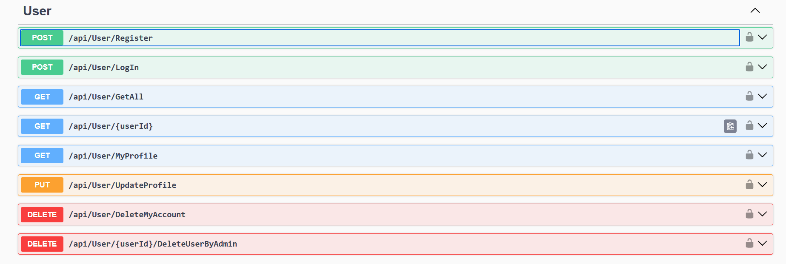](DigitalShop.Api/Controllers/UserController.cs)

[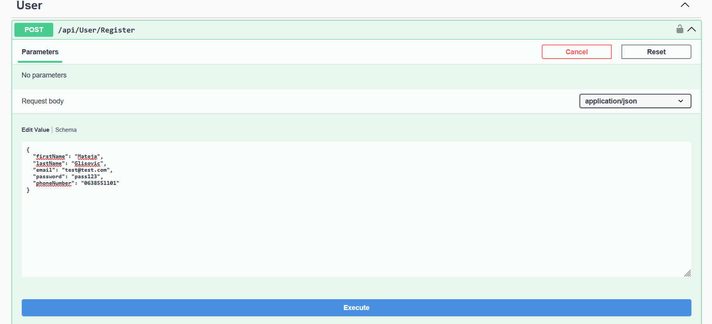](DigitalShop.Application/Validators/UserValidators/UserRegistratorValidator.cs)
[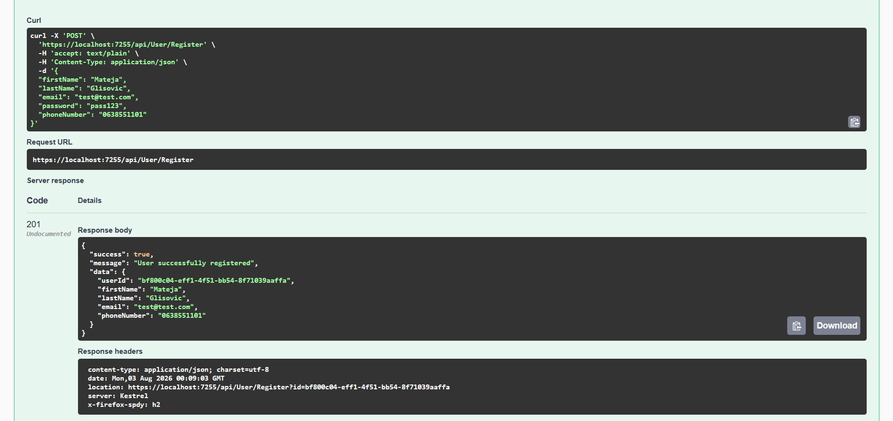](DigitalShop.Api/Controllers/UserController.cs)
[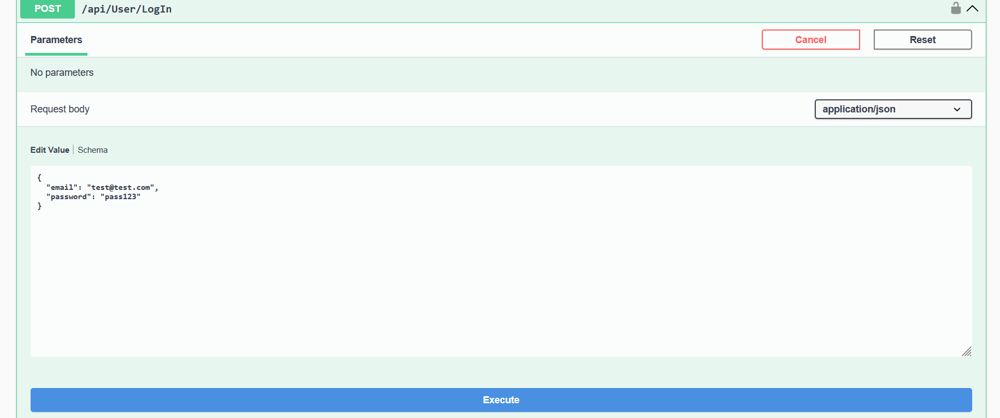](DigitalShop.Application/Validators/UserValidators/UserLoginValidator.cs)
[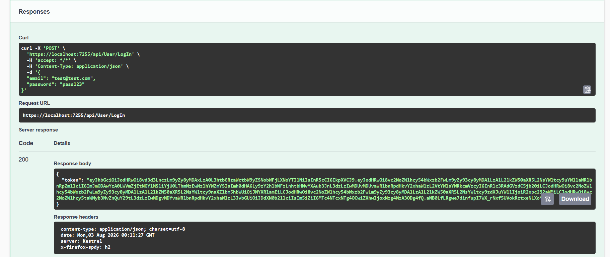](DigitalShop.Application/Helpers/AuthHelpers.cs)
[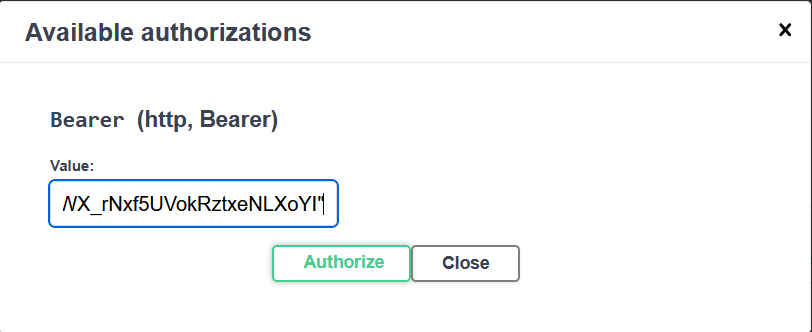](DigitalShop.Api/Program.cs)
[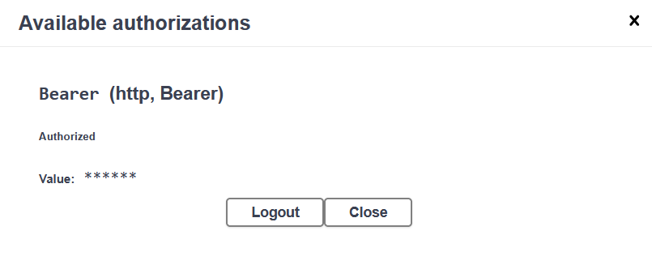](DigitalShop.Api/Program.cs)

### 3. Database State (SQLite)
[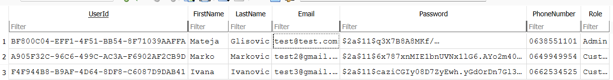](DigitalShop.Infrastructure/Data/DataContext.cs)
[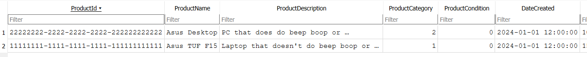](DigitalShop.Infrastructure/Data/DataContext.cs)
[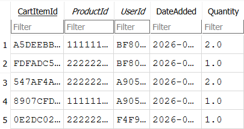](DigitalShop.Infrastructure/Data/DataContext.cs)

### 4. Advanced Analytics & Reporting (LINQ)
[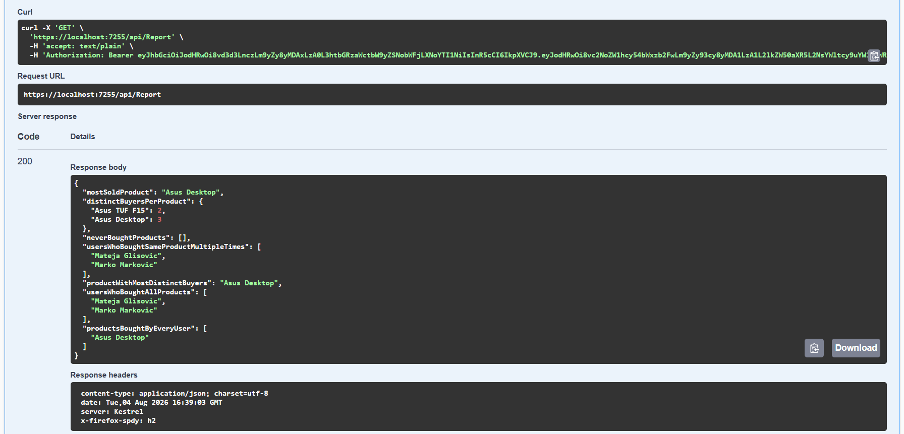](DigitalShop.Infrastructure/Repo/ReportRepository.cs)
